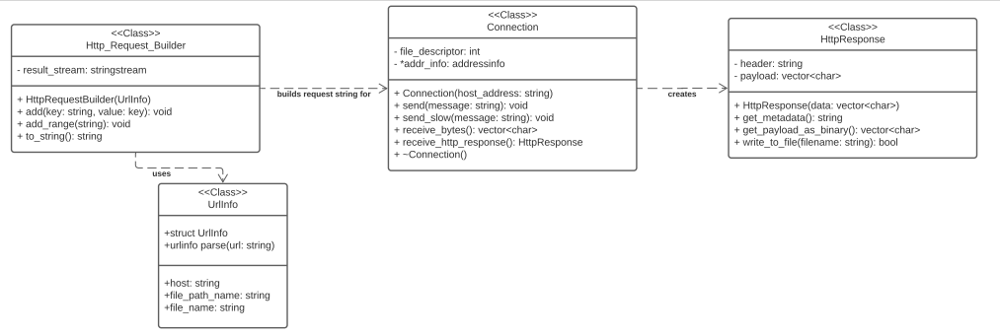

# Klassendiagramm: Struktur der Applikation
**Connection:**
- Initialisierung einer Verbindung mit einer URL
- Destruktor zum automatisierten Schließen einer Verbindung
- Abfragen von IP-Informationen des Hostname über DNS
- Durchführen eines HTTP-GET-Requests

**HttpRequest:**
- Klasse zur Initialisierung eines HTTP-Requests
- Setzen gewünschter Header-Felder

**HttpResponse:**
- Speichern empfangener HttpResponse in separaten Datenstrukturen
- Statuscode und textuelle Informationen zum HTTP-Status
- Header-Informationen
- Payload: empfangene Nutzdaten



# Sequenzdiagramm: Ablauf eines GET-Requests
- Aufbau der Verbindung über TCP
- Senden des HTTP-GET-Requests
- Empfang der HTTP-GET-HttpResponse
- Schließen der Verbindung über TCP
```mermaid
sequenceDiagram
    participant client
    participant server_ip
    client->>server_ip: getaddrinfo(hostname)
    server_ip-->>client: getaddrinfo(): ip_addr
    client->>server_ip: connect(ip_addr)
    server_ip-->>client: connect(): SUCCESS
    
    client-)server_ip: send(HttpRequest)
    server_ip-->>client: send(): ACK
    loop while bytes_recvd > 0
        client->>server_ip: recv(CHUNK_SIZE)
        server_ip-->>client: recv(): buffer[CHUNK_SIZE]
        client->>+client: result_buffer += buffer
    end
        alt write_to_file
            client->>client: write_to_file(result_buffer)
        else
            client->>client: std::cout << result_buffer
        end
    
    client->>server_ip: close(ip_addr)
    server_ip-->>client: close(): SUCCESS
```

# Initialisierung
### ... des TCP-Sockets
```c
int fd = socket(AF_INET, SOCK_STREAM, 0);
```

### ... einer Verbindung mit dem HTTP-Server
```c++
// Structs zum Füllen der Addressinformationen
addrinfo *address_info{};
struct addrinfo hints{.ai_family = AF_UNSPEC, .ai_socktype = SOCK_STREAM};

// Auflösen der IP-Adresse
getaddrinfo("www.example.net", "http", &hints, &address_info);

// Verbinden mit dem Server
connect(fd, address_info->ai_addr, address_info->ai_addrlen);
```